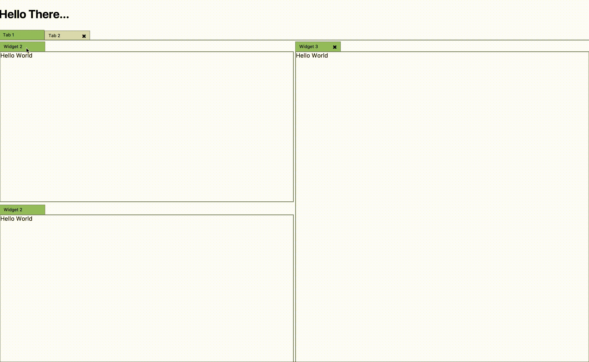

# Phosphor Web Components 

This is a collection of two [web components](https://developer.mozilla.org/en-US/docs/Web/Web_Components) based on the [phosphor](http://www.github.com/phosphorjs/phosphor) library which provide a generic tab, and dock html component. 

 Package     | Version
:------------|:---------------------------------------------------------------------------------|
Dock-Layout  | 
Tab-Layout   | 
Shared       | 

## Documentation 

[Read the docs](./docs)